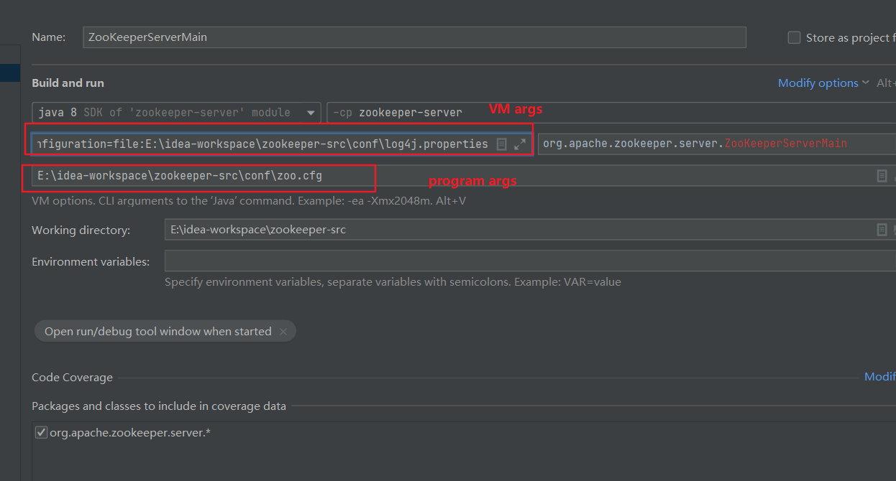

# Apache ZooKeeper   

For the latest information about Apache ZooKeeper, please visit our website at:

   http://zookeeper.apache.org/

and our wiki, at:

   https://cwiki.apache.org/confluence/display/ZOOKEEPER

---------------------------
Packaging/release artifacts

Either downloaded from https://zookeeper.apache.org/releases.html or
found in zookeeper-assembly/target directory after building the project with maven.

    apache-zookeeper-[version].tar.gz

        Contains all the source files which can be built by running:
        mvn clean install

        To generate an aggregated apidocs for zookeeper-server and zookeeper-jute:
        mvn javadoc:aggregate
        (generated files will be at target/site/apidocs)

    apache-zookeeper-[version]-bin.tar.gz

        Contains all the jar files required to run ZooKeeper
        Full documentation can also be found in the docs folder

As of version 3.5.5, the parent, zookeeper and zookeeper-jute artifacts
are deployed to the central repository after the release
is voted on and approved by the Apache ZooKeeper PMC:

  https://repo1.maven.org/maven2/org/apache/zookeeper/zookeeper/

## Java 8

If you are going to compile with Java 1.8, you should use a
recent release at u211 or above.

# Contributing
We always welcome new contributors to the project! See [How to Contribute](https://cwiki.apache.org/confluence/display/ZOOKEEPER/HowToContribute) for details on how to submit patch through pull request and our contribution workflow.

### 源码编译注意事项

1. zookeeper-server中的pom依赖 jetty的scope注释即可，不行就刷新后，清楚重新构建，一般不会有问题
2. 启动配置看图：

3. zk-api 是自己建的模块，主要学习一下zk的api,一个注册中心和分布式锁小实验，代码并不完善
4. 关于集群启动jetty端口占用问题请看zoo.cfg文件中的配置